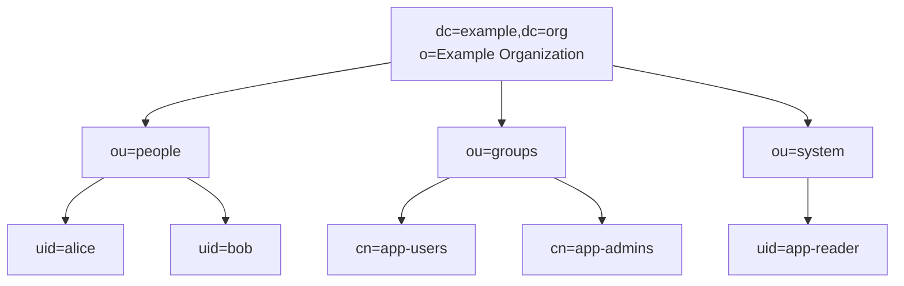

# Understanding the LDIF File

The file `docker-compose/ldifs/01-bootstrap.ldif` contains LDAP entries that are imported when the directory is initialized for the first time.

## DIT overview

The sample LDIF creates this Directory Information Tree (DIT):



Full distinguished names represented in the tree:

- `dc=example,dc=org`
- `ou=people,dc=example,dc=org`
- `ou=groups,dc=example,dc=org`
- `ou=system,dc=example,dc=org`
- `uid=app-reader,ou=system,dc=example,dc=org`
- `uid=alice,ou=people,dc=example,dc=org`
- `uid=bob,ou=people,dc=example,dc=org`
- `cn=app-users,ou=groups,dc=example,dc=org`
- `cn=app-admins,ou=groups,dc=example,dc=org`

The root entry is important because it creates the actual base object for the directory. Without it, the server may advertise `dc=example,dc=org` as a naming context, but subtree searches under that DN can still fail with `No such object`.

An LDIF file is a text representation of LDAP data. Each block describes one entry. The first block in this file creates the base entry:

```ldif
dn: dc=example,dc=org
objectClass: dcObject
objectClass: organization
dc: example
o: Example Organization
```

This creates the root of the sample directory tree.

Another example is the `people` organizational unit:

```ldif
dn: ou=people,dc=example,dc=org
objectClass: organizationalUnit
ou: people
```

This creates an entry with:

- `dn`: the Distinguished Name, which is the full unique path of the entry in the LDAP tree
- `objectClass`: the schema type of the entry
- `ou`: the organizational unit name

In this example, `ou=people` is like a container under `dc=example,dc=org` where user entries can be stored.

```ldif
objectClass: organizationalUnit
```

Each LDAP entry must declare its own type, even if another entry uses the same type.

## How authorization would work with groups

The authorization model is based on LDAP groups:

```ldif
dn: cn=app-users,ou=groups,dc=example,dc=org
objectClass: groupOfNames
cn: app-users
member: uid=alice,ou=people,dc=example,dc=org
member: uid=bob,ou=people,dc=example,dc=org

dn: cn=app-admins,ou=groups,dc=example,dc=org
objectClass: groupOfNames
cn: app-admins
member: uid=alice,ou=people,dc=example,dc=org
```

This means:

- both `alice` and `bob` are members of `app-users`
- only `alice` is a member of `app-admins`

An application can use those group memberships to decide which roles a user has after authentication succeeds.

## What the service account is for

The entry `uid=app-reader,ou=system,dc=example,dc=org` is a service account that an application can use to search the directory before attempting user authentication.

A common LDAP login flow is:

- the application binds as `app-reader`
- it searches for a user by `uid`, such as `(uid=alice)`
- it retrieves the user's full DN
- it tries to bind as that user with the password provided at login
- it searches group entries to determine the user's roles

## Where names like `inetOrgPerson` come from

Names such as `organizationalUnit`, `inetOrgPerson`, and `groupOfNames` come from LDAP schema definitions. They are not invented in the LDIF file.

The LDIF file only uses those object classes. The LDAP server already knows what they mean because the corresponding schemas are loaded in the server configuration.

In other words:

- the server provides the schema definitions.
- the LDIF file provides the directory data.

If you use an object class or attribute that the server does not know, the import will fail with a schema-related error.

## Can you add more attributes?

Yes. If an object class allows additional attributes, you can add them to the LDIF entry.

For example, `organizationalUnit` can be extended with optional attributes if they are allowed by the loaded schema. A minimal entry is:

```ldif
dn: ou=people,dc=example,dc=org
objectClass: organizationalUnit
ou: people
```

But you may be able to add optional attributes such as:

```ldif
description: Container for user accounts
```

The rule is: an attribute must be allowed by at least one of the entry's object classes, or by one of their inherited parent classes.

For user entries in this example, the same rule applies. If you want to add more user attributes, they must be allowed by `inetOrgPerson` or another object class you choose to add to the entry.

## RFCs versus what the container actually accepts

RFCs and OpenLDAP schema documentation are good references for understanding what an object class means and which attributes it may accept.

In practice, the most important source is the schema actually loaded in the running LDAP server. That is what determines whether a given LDIF entry will be accepted by your container.

If you want additional background, these RFCs are especially useful for this lab:

- [RFC 2849 - The LDAP Data Interchange Format (LDIF)](https://datatracker.ietf.org/doc/html/rfc2849)
- [RFC 4510 - LDAP: Technical Specification Road Map](https://datatracker.ietf.org/doc/html/rfc4510)
- [RFC 4511 - LDAP: The Protocol](https://datatracker.ietf.org/doc/html/rfc4511)
- [RFC 4512 - LDAP: Directory Information Models](https://datatracker.ietf.org/doc/html/rfc4512)
- [RFC 4513 - LDAP: Authentication Methods and Security Mechanisms](https://datatracker.ietf.org/doc/html/rfc4513)
- [RFC 4514 - String Representation of Distinguished Names](https://datatracker.ietf.org/doc/html/rfc4514)
- [RFC 4515 - String Representation of Search Filters](https://datatracker.ietf.org/doc/html/rfc4515)
- [RFC 4517 - LDAP: Syntaxes and Matching Rules](https://datatracker.ietf.org/doc/html/rfc4517)
- [RFC 4519 - LDAP: Schema for User Applications](https://datatracker.ietf.org/doc/html/rfc4519)
